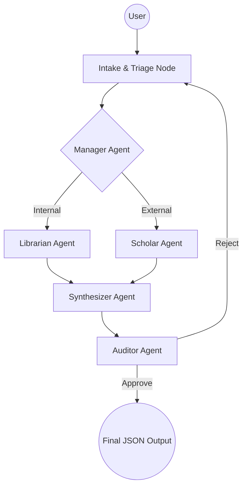

# 🚀 Multi-Agent Corporate Intelligence Hub

An industrial-grade, local-first multi-agent system built using **LangGraph** and the **OpenAI Agent SDK**. This project demonstrates advanced agentic patterns, including autonomous handoffs, structured Pydantic I/O, and self-correcting audit loops—all running on local models via **Ollama**.

---

## 🏗️ Architecture

The system follows a **Manager-Specialist** pattern orchestrated by a cyclic LangGraph DAG.



### 🤖 The Agent Team
1.  **The Manager**: Primary entry point. Triages requests and performs dynamic handoffs.
2.  **The Librarian**: specialist in internal JSON records and proprietary knowledge.
3.  **The Scholar**: specialist in external research using the **DuckDuckGo** tool.
4.  **The Synthesizer**: Senior Analyst that merges raw data into a structured `CorporateMemo`.
5.  **The Auditor**: Quality Control agent that validates the final output against a strict `AuditReview` schema.

---

## 💎 Key Features

-   **100% Local-First**: Uses Ollama (`qwen3-vl:235b-cloud`) to ensure data privacy and zero API costs.
-   **Structured I/O**: Every tool input and agent output is strictly validated using **Pydantic** models.
-   **Persistence (Memory)**: Uses LangGraph `MemorySaver` to maintain state across multi-turn conversations.
-   **Self-Correction**: An automated Audit loop that triggers re-research if a memo fails quality standards.
-   **JSON-Native Interface**: Optimized for headless integration; input is captured as strings and results are delivered as clean JSON.

---

## 🛠️ Tech Stack

-   **Orchestration**: [LangGraph](https://github.com/langchain-ai/langgraph)
-   **Agent Framework**: [OpenAI Agent SDK](https://github.com/openai/openai-agents-python)
-   **Model Backend**: [Ollama](https://ollama.com/)
-   **Search**: [DuckDuckGo Search](https://python.langchain.com/docs/integrations/tools/ddg/)
-   **Validation**: [Pydantic v2](https://docs.pydantic.dev/latest/)

---

## 🚀 Getting Started

### 1. Prerequisites
-   Install **Ollama** and pull the required model:
    ```bash
    ollama pull qwen3-vl:235b-cloud
    ```
-   Install **uv** (recommended Python manager).

### 2. Installation
```bash
git clone <your-repo-url>
cd langgraph-ollama-agent
uv sync
```

### 3. Environment Setup
Create a `.env` file in the root:
```env
OPENAI_BASE_URL=http://localhost:11434/v1
OPENAI_API_KEY=ollama
LOCAL_MODEL_NAME=qwen3-vl:235b-cloud
DATABASE_PATH=data/knowledge.json
```

### 4. Running the Assistant
```bash
uv run python main.py
```

---

## 📝 Example Queries

Test the system with these prompts:
-   **Internal**: *"When is our salary processed each month?"*
-   **Web Search**: *"What is the latest stock price and news for NVIDIA today?"*
-   **Hybrid**: *"Compare our office hours with working culture trends in San Francisco for 2026."*

---

## 📂 Project Structure
```text
.
├── main.py                 # CLI Entry point & JSON Output logic
├── data/
│   └── knowledge.json      # Pure internal knowledge base
└── src/
    ├── core/
    │   ├── config.py       # Global logging & environment
    │   └── state.py        # Pydantic schemas (Memo, Audit, Search)
    ├── agent_logic/
    │   └── definitions.py  # Agent personas & output_types
    ├── workflow/
    │   └── graph.py        # LangGraph DAG & Robust JSON parsing
    ├── tools/
    │   └── web_tools.py    # Structured DuckDuckGo tool
    └── repository/
        └── internal_db.py  # Local JSON search logic
```

---
*Created by Antigravity - A Gold Standard Reference for Local-First Multi-Agent Systems.*
