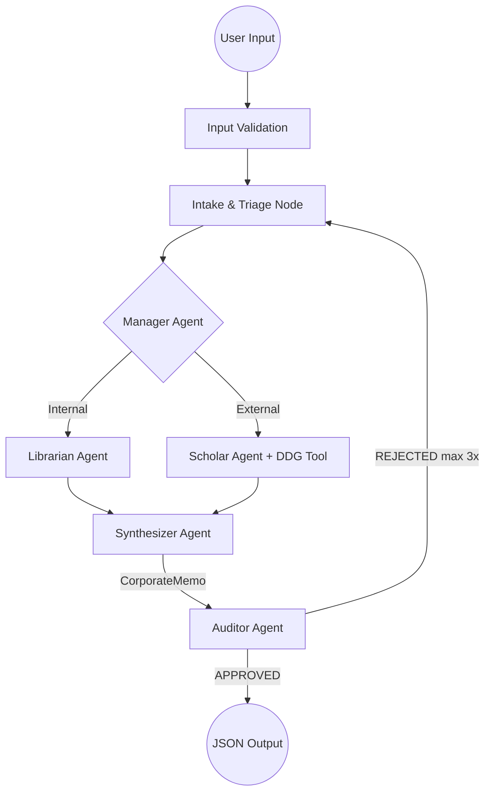

# 🚀 Multi-Agent Corporate Intelligence Hub

A **production-ready**, local-first multi-agent system built with **LangGraph** and the **OpenAI Agent SDK**. Demonstrates advanced agentic patterns — autonomous handoffs, structured Pydantic I/O, self-correcting audit loops, and graceful error recovery — all running locally via **Ollama**.

---

## 🏗️ Architecture

The system follows a **Manager-Specialist** pattern orchestrated by a cyclic LangGraph DAG with automatic retry and self-correction.



### 🤖 The Agent Team

| Agent | Role | Output Type |
|-------|------|-------------|
| **Manager** | Triages queries, performs handoffs | Plain text |
| **Librarian** | Searches internal JSON knowledge base | Plain text |
| **Scholar** | Searches the web via DuckDuckGo | Plain text |
| **Synthesizer** | Merges findings into a structured memo | `CorporateMemo` |
| **Auditor** | Validates quality, approves/rejects | `AuditReview` |

---

## 💎 Production-Ready Features

### Input Validation
- `QueryInput` Pydantic model with `min_length=3`, `max_length=500`
- Prompt-injection guard (blocks `<script>`, `DROP TABLE`, etc.)
- Empty/whitespace rejection

### Output Validation
- `CorporateMemo` and `AuditReview` enforced via `output_type` on agents
- All list fields use `default_factory=list` to prevent `""` vs `[]` errors

### Error Recovery
- `run_structured_agent()` — automatic retry with prompt hints on JSON validation failures
- `clean_and_parse()` — strips Markdown fences and extracts JSON from mixed output
- Graceful degradation: errors are returned as structured JSON, not raw tracebacks

### Persistence & Observability
- LangGraph `MemorySaver` maintains state across multi-turn conversations
- Structured `logging` (no `print()`) with timestamps and severity levels
- `Settings` class validated at startup via Pydantic — app fails fast on bad `.env`

---

## 🛠️ Tech Stack

| Component | Technology |
|-----------|-----------|
| Orchestration | [LangGraph](https://github.com/langchain-ai/langgraph) |
| Agent Framework | [OpenAI Agent SDK](https://github.com/openai/openai-agents-python) |
| Model Backend | [Ollama](https://ollama.com/) (local) |
| Web Search | [DuckDuckGo Search](https://python.langchain.com/docs/integrations/tools/ddg/) |
| Validation | [Pydantic v2](https://docs.pydantic.dev/latest/) |
| Config | `pydantic.BaseModel` with `@field_validator` |

---

## 🚀 Getting Started

### 1. Prerequisites
```bash
ollama pull qwen3-vl:235b-cloud
```

### 2. Installation
```bash
git clone <your-repo-url>
cd langgraph-ollama-agent
uv sync
```

### 3. Environment Setup
Create a `.env` file:
```env
OPENAI_BASE_URL=http://localhost:11434/v1
OPENAI_API_KEY=ollama
LOCAL_MODEL_NAME=qwen3-vl:235b-cloud
DATABASE_PATH=data/knowledge.json
```

### 4. Run
```bash
uv run python main.py
```

---

## 📝 Example Queries

| Type | Query |
|------|-------|
| **Internal** | `When is our salary processed each month?` |
| **Internal** | `What are the office hours for the main branch?` |
| **Web** | `What is the latest stock price and news for NVIDIA?` |
| **Web** | `What are the top AI agent headlines in 2026?` |
| **Hybrid** | `Compare our office hours with Silicon Valley work culture trends in 2026` |

---

## 📂 Project Structure
```
.
├── main.py                    # CLI Entry point with input validation & JSON output
├── data/
│   └── knowledge.json         # Internal knowledge base
└── src/
    ├── core/
    │   ├── config.py           # Pydantic-validated Settings, logging, telemetry
    │   └── state.py            # All Pydantic schemas (Input, Output, State)
    ├── agent_logic/
    │   └── definitions.py      # Agent personas with output_type enforcement
    ├── workflow/
    │   └── graph.py            # LangGraph DAG, retry logic, JSON cleaner
    ├── tools/
    │   └── web_tools.py        # Structured DuckDuckGo tool with logging
    └── repository/
        └── internal_db.py      # Typed KnowledgeRecord search with error handling
```

---

## 🏆 Best Practice Checklist

| # | Practice | Status |
|---|----------|--------|
| 1 | Structured Input Validation (Pydantic) | ✅ |
| 2 | Structured Output Enforcement (`output_type`) | ✅ |
| 3 | Prompt-Injection Guard | ✅ |
| 4 | Fail-Fast Config Validation | ✅ |
| 5 | Structured Logging (no `print()`) | ✅ |
| 6 | Automatic Retry on LLM Validation Errors | ✅ |
| 7 | Markdown/JSON Cleaner for Local Models | ✅ |
| 8 | Memory Persistence (`MemorySaver`) | ✅ |
| 9 | Self-Correcting Audit Loop | ✅ |
| 10 | Agent Handoffs (OpenAI SDK) | ✅ |
| 11 | Typed Tool Input (`SearchConfig`) | ✅ |
| 12 | Typed DB Records (`KnowledgeRecord`) | ✅ |
| 13 | JSON-Native Error Responses | ✅ |
| 14 | Telemetry Disabled for Local Use | ✅ |

---

*Gold-standard reference architecture for local-first multi-agent systems.*
